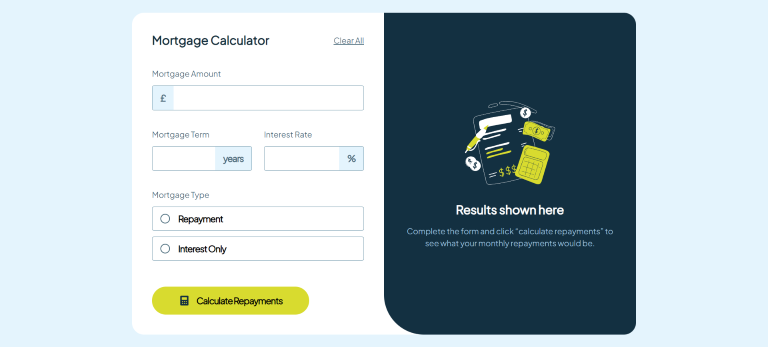

# Frontend Mentor - Mortgage repayment calculator solution

This is a solution to the [Mortgage repayment calculator challenge on Frontend Mentor](https://www.frontendmentor.io/challenges/mortgage-repayment-calculator-Galx1LXK73). Frontend Mentor challenges help you improve your coding skills by building realistic projects.

## Table of contents

- [Overview](#overview)
  - [The challenge](#the-challenge)
  - [Screenshot](#screenshot)
  - [Links](#links)
- [My process](#my-process)
  - [Built with](#built-with)
  - [What I learned](#what-i-learned)
  - [Continued development](#continued-development)
- [Author](#author)

## Overview

### The challenge

Users should be able to:

- Input mortgage information and see monthly repayment and total repayment amounts after submitting the form
- See form validation messages if any field is incomplete
- Complete the form only using their keyboard
- View the optimal layout for the interface depending on their device's screen size
- See hover and focus states for all interactive elements on the page

### Screenshot

### Links

- Solution URL: [Solution](https://github.com/socratesioa/mortgage-repayment-calculator)
- Live Site URL: [Live Site](https://socratesioa.github.io/mortgage-repayment-calculator)

## My process

### Built with

- Semantic HTML5 markup
- CSS custom properties
- Flexbox
- CSS Grid
- Mobile-first workflow
- JavaScript
- Cleave.js

### What I learned

This was a great challenge for practicing form validation. Slightly more difficult than the ones I did before. My biggest take away from this challenge was learning to make the script a bit more modular especially for error handling. Even though the input fields were not that many, I intentionally try to come up with modular solution that can easily be scaled. Also I had to use cleave.js to format the mortgage amount input field.

### Continued development

There is no better way to learn than to keep practicing on actual projects. Every challenge makes me feel more confident once completed.

## Author

- Website - [My Portfolio](https://portfolio.thisissocrates.com/)
- Frontend Mentor - [@socratesioa](https://www.frontendmentor.io/profile/socratesioa)
